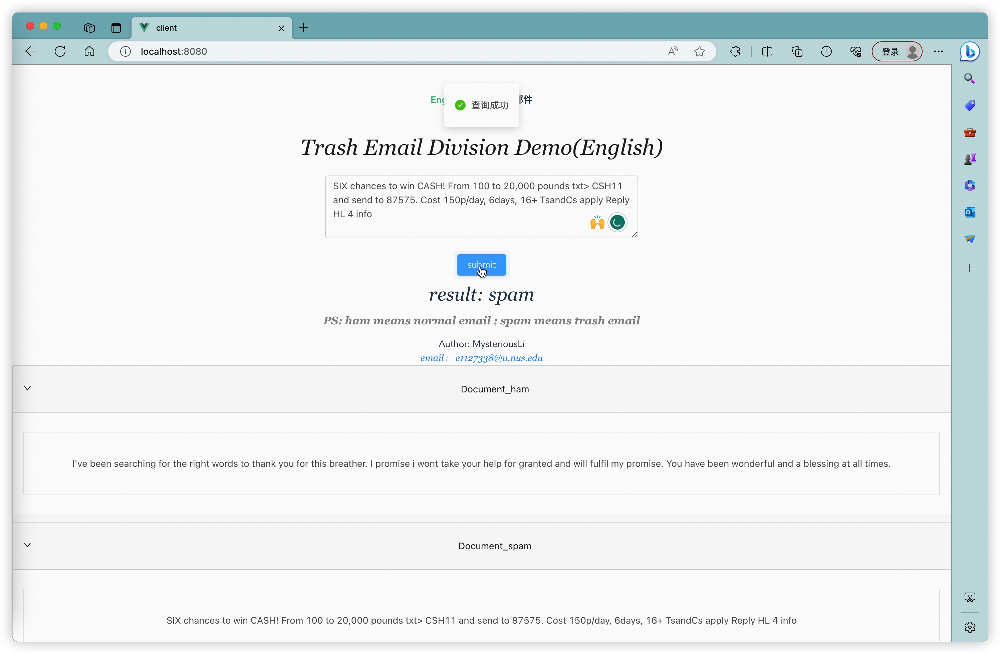

# mini-sms-classify
>垃圾邮件分类（朴素贝叶斯算法），使用flask+vue

### 背景
* 2002年，Paul Graham提出使用"贝叶斯推断"过滤垃圾邮件。他说，这样做的效果，好得不可思议。1000封垃圾邮件可以过滤掉995封，且没有一个误判。
* 因为典型的垃圾邮件词汇在垃圾邮件中会以更高的频率出现，所以在做贝叶斯公式计算时，肯定会被识别出来。之后用最高频的15个垃圾词汇做联合概率计算，联合概率的结果超过90%将说明它是垃圾邮件。
* 用贝叶斯过滤器可以识别很多改写过的垃圾邮件，而且错判率非常低。甚至不要求对初始值有多么精确，精度会在随后计算中逐渐逼近真实情况。
* 贝叶斯公式其实类似人脑的学习过程，这使得他在机器学习中广泛的应用：baby学一个新单词，他一开始并不知道这个词是什么意思，但是他可以根据当时的情景，先来个猜测（先验概率/主观判断）。一有机会，他就会在不同的场合说出这个词，然后观察你的反应。如果我告诉他用对了，他就会进一步记住这个词的意思，如果我告诉他用错了，他就会进行相应调整。（可能性函数/调整因子）。经过这样反复的猜测、试探、调整主观判断，就是贝叶斯定理思维的过程。
* 这过程就是：主观判断（先验概率）+ 搜集的信息（可能性函数）= 优化概率（后验概率）
* $\ P(S|W)=\frac{P(W|S)*P(S)}{P(W|S)*P(S)+P(W|H)*P(H)}$
* 其中用W表示某个词，现在需要计算P(S|W)的值，即在某个词语（W）已经存在的条件下，垃圾邮件（S）的概率有多大。
* 其中的分母是P(W)的全概率公式，意味着：在垃圾邮件的情况下某个词语（W）的出现概率，加上在正常邮件的情况下某个词语（W）的出现概率
## 朴素贝叶斯分类
## 如何运行
### server端
```bash
cd server
# 创建虚拟环境
python -m venv env
# 激活虚拟环境
source env/bin/activate
# 安装依赖包
pip install -r requirements.txt
#下载jieba，中文分词
https://pypi.org/project/jieba/#files
解压后，打开，使用
python setup.py install, 安装到特定的python运行环境
# 启动flask
python app.py

```
### client端
```bash
cd client #但一定要 否则在根目录init package.json会出问题
npm install
npm run serve
```
* 解释 ： models文件夹下面是英文分词的模型
* models2文件夹下面是中文分词的模型
* 其中的Analyzer.py是评估中文分词效果，运行时候需要将

## 注意
* macos 安装的时候 参考 https://tiven.cn/p/fd5c1da4/
* error:0308010C:digital envelope routines::unsupported

```bash
export NODE_OPTIONS=--openssl-legacy-provider
```
* 运行演示
