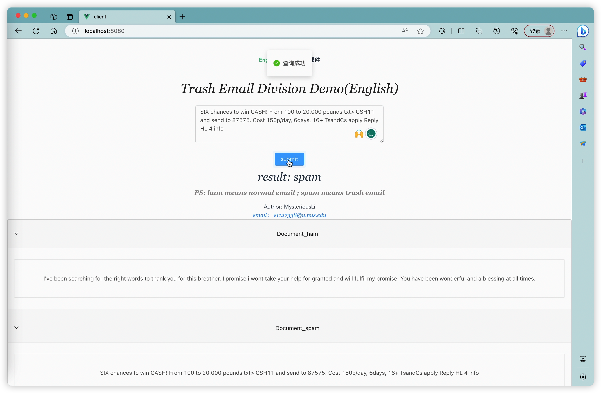

# mini-sms-classify
> Spam email classification (Naive Bayes algorithm) using Flask + Vue

### Background
* In 2002, Paul Graham proposed using "Bayesian inference" to filter spam emails. He claimed that the results were incredibly effective. It could filter out 995 out of 1000 spam emails with no false positives.
* Because typical spam email vocabulary appears more frequently in spam emails, it is likely to be recognized when calculating the Bayesian formula. Subsequently, the top 15 most frequent spam words are used for joint probability calculations. If the result of the joint probability exceeds 90%, it indicates that it is a spam email.
* Bayesian filters can identify many modified spam emails with a very low false positive rate. They do not even require precise initial values, as accuracy gradually approaches reality in subsequent calculations.
* The Bayesian formula is actually similar to the learning process of the human brain, which makes it widely used in machine learning. When a baby learns a new word, they don't initially know its meaning, but they can make a guess based on the context (prior probability/subjective judgment). When they have the opportunity, they will use the word in different situations and observe your reaction. If they are told they used it correctly, they will further remember the word's meaning; if they are told they used it incorrectly, they will make the necessary adjustments (likelihood function/adjustment factor). This process of repeated guessing, testing, and adjusting subjective judgments is the thinking process of the Bayesian theorem.
* This process can be summarized as: subjective judgment (prior probability) + collected information (likelihood function) = optimized probability (posterior probability).
* $\ P(S|W)=\frac{P(W|S)*P(S)}{P(W|S)*P(S)+P(W|H)*P(H)}$
* In this equation, W represents a certain word, and we need to calculate the value of P(S|W), which is the probability of spam (S) given that a certain word (W) already exists.
* The denominator is the full probability formula of P(W), which means: the probability of a certain word (W) appearing in spam emails, plus the probability of it appearing in normal emails.

## Naive Bayes Classification
## How to Run
### Server Side
```bash
cd server
# Create a virtual environment
python -m venv env
# Activate the virtual environment
source env/bin/activate
# Install dependencies
pip install -r requirements.txt
# Download Jieba, a Chinese word segmentation tool
https://pypi.org/project/jieba/#files
After extracting, open it, and use
python setup.py install to install it in the specific Python runtime environment.
# Start Flask
python app.py
```
### Client Side
``` bash
cd client # Make sure to do this, otherwise, there may be issues with initializing package.json in the root directory
npm install
npm run serve
```
* Explanation: The "models" folder contains models for English word segmentation, while the "models2" folder contains models for Chinese word segmentation. The "Analyzer.py" is used to evaluate the effectiveness of Chinese word segmentation, and you need to run it with:
### Note
* For macOS installation, refer to https://tiven.cn/p/fd5c1da4/
* For M1 chip if you encounter the "error:0308010C:digital envelope routines::unsupported" error, run the following command:
```
export NODE_OPTIONS=--openssl-legacy-provider
```
* basic function show
